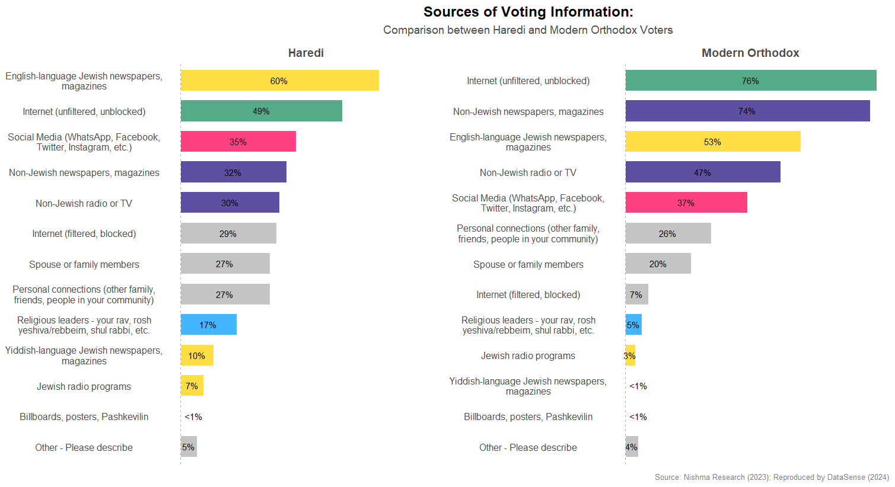

## Visuals by DataSense.

### 1. Orthodox Jewish Voter Information Sources

[Data Source](https://www.harediresearchgroup.org/wp-content/uploads/2023/09/REPORT-Orthodox-Jewish-Political-Attitudes-and-Behaviors-September-2023.pdf), [__Viz Code__](./R/1-voter-information.R)

### 2. Naming Trends after Hasidic Rebbes Death

[Data Source](https://www.ssa.gov/oact/babynames/limits.html), [Viz Code](https://github.com/getdatasense/datasense-visuals/blob/main/inst/tsx/naming-trends-chart.tsx)

